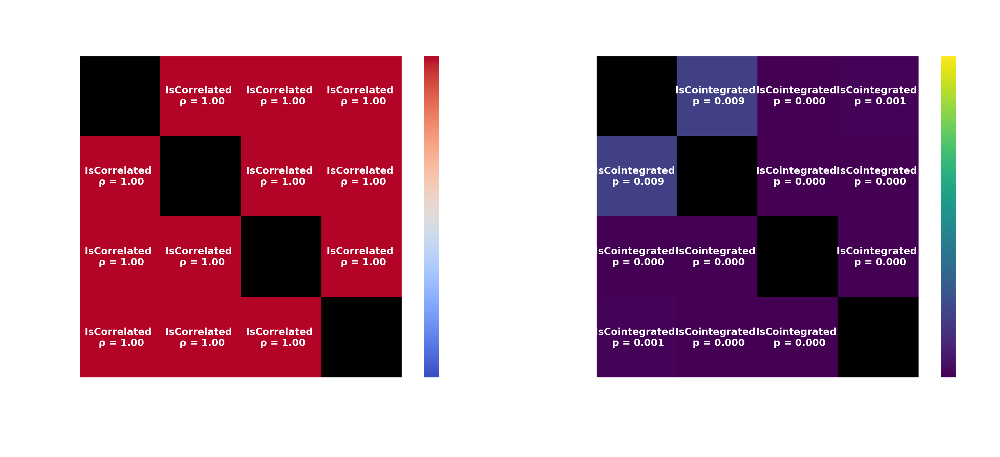
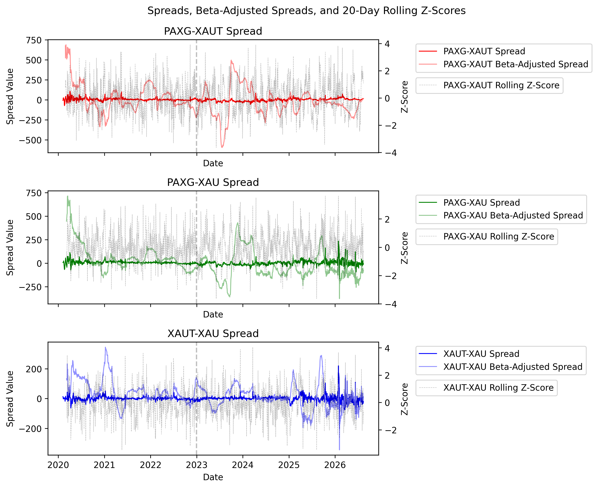
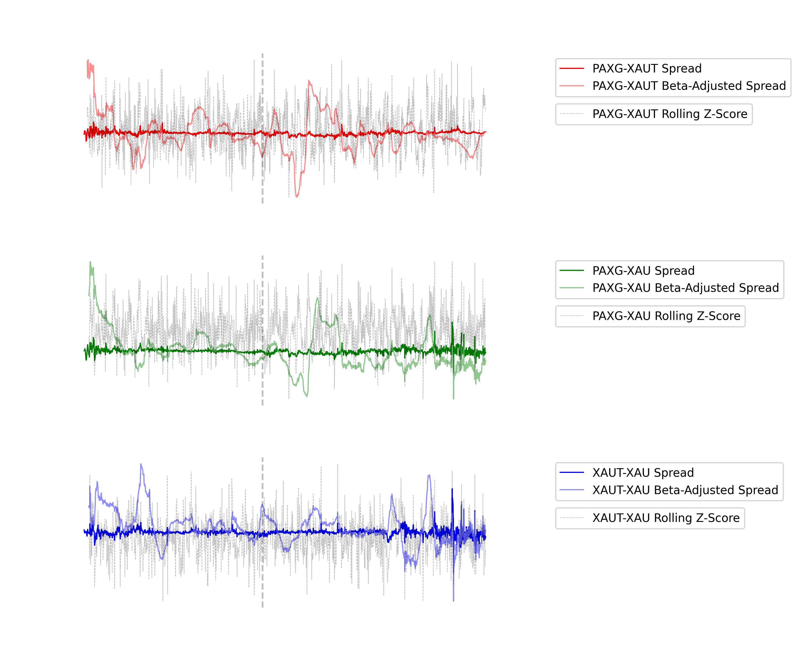
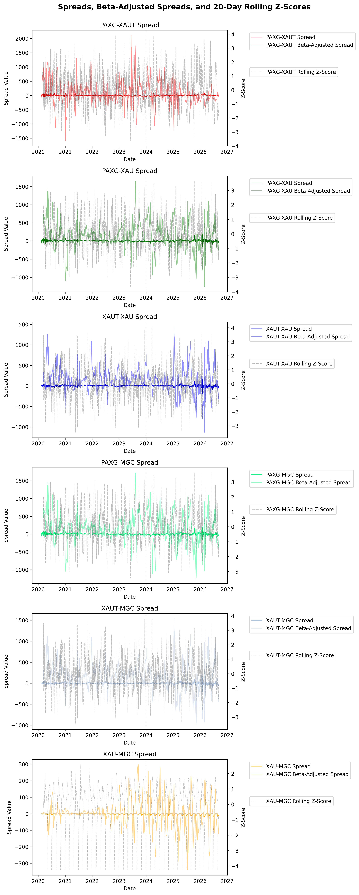
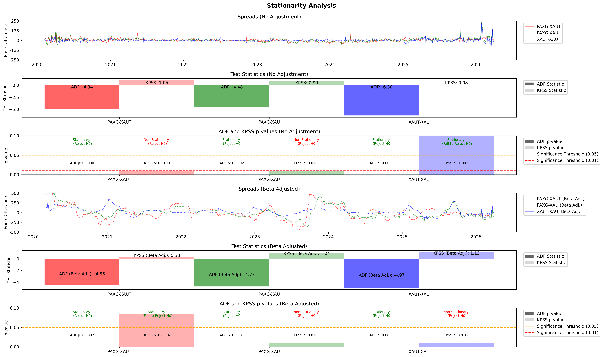
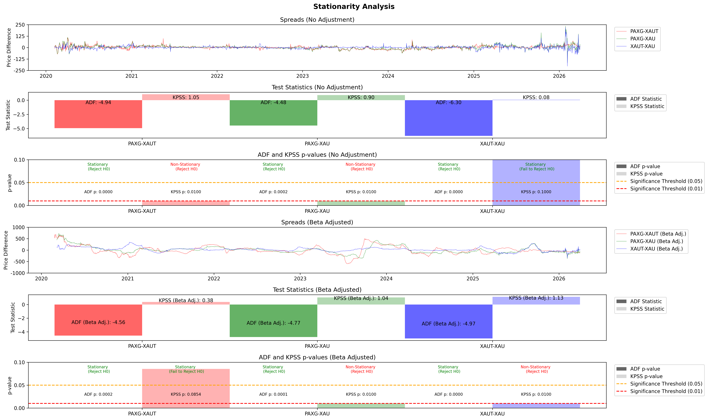
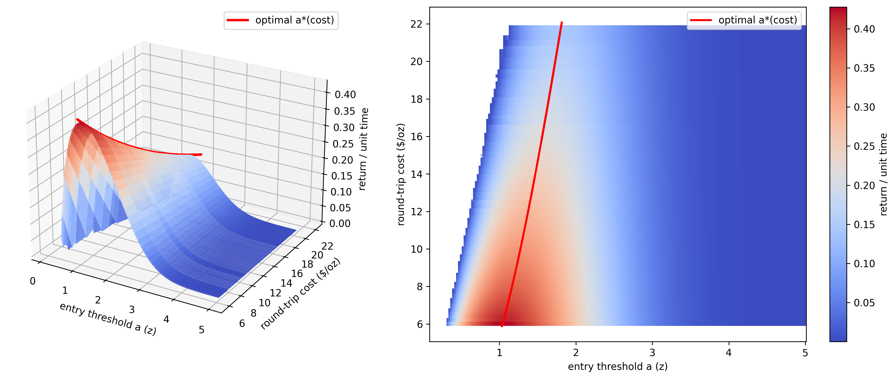
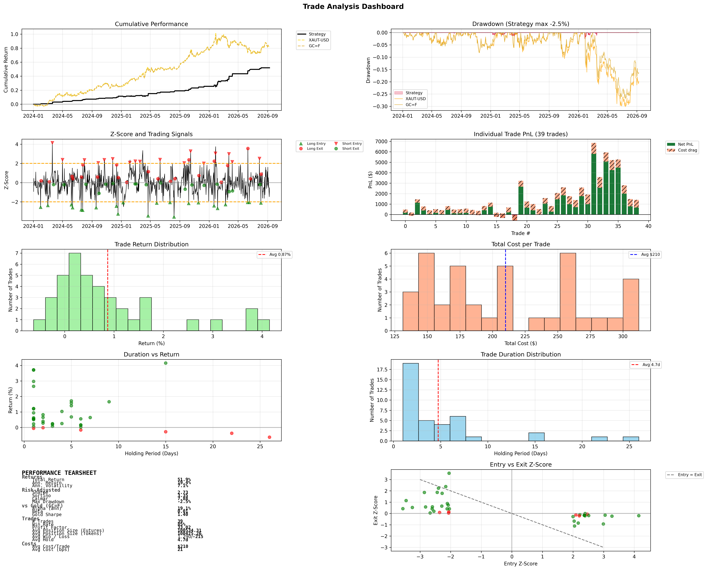

# Tokenized Gold Statistical Arbitrage

Analysing Statistical Arbitrage on Tokenized Gold Assets and Gold Futures and Comparing Results of these Arbitrage Strategies With Gold Returns

This project explores whether tokenized gold products and gold futures exhibit statistically robust mean-reverting relationships that can be traded as a pairs or spread strategy. 

The analysis focuses on assets such as PAXG-USD, XAUT-USD, MGC=F and GC=F, and evaluates whether spread-based signals remain economically meaningful before and after accounting for beta adjustments and execution cost considerations.

## Pairwise Correlation & Cointegration Analysis

The empirical approach is built around the null hypothesis that the pairs do not share a stable long-run equilibrium. To evaluate this, pairwise correlations are computed, then Engle-Granger cointegration tests to the spread between each asset pair. If the residuals of the spread regression are stationary and the cointegration test rejects the null of no cointegration at conventional significance levels (for example, p < 0.05), that is evidence in favour of a mean-reverting relationship rather than mere contemporaneous co-movement. In other words, the strategy is not being justified by correlation alone; it requires the spread itself to behave like a statistically stable, reverting process.

Key result: All pairs aree highly correlated and cointegration is confirmed

# Normalised Spreads Preliminary Analysis

Visual check for mean reversion properties confirms spreads oscillate around some level.

## Pairwise Stationarity Analysis

Applying ADF and KPSS tests to the spread series help confirm this visual check as statistically significant properties. ADF tests the null of a unit root (non-stationarity), while KPSS tests the null of stationarity. Taken together, these tests help distinguish between a temporary mispricing process and a genuinely stable spread relationship. If the ADF rejects non-stationarity and the KPSS fails to reject stationarity, the evidence is consistent with a mean-reverting spread that can be normalized with z-scores and traded systematically. Conversely, if both tests point away from stationarity, the spread may not offer a robust arbitrage signal.

### Stationarity and threshold diagnostics

### Trade dashboard

## Interpretation

The project does not treat the strategy as a guaranteed profit engine. Rather, it offers evidence that gold-linked products can share a mean-reverting spread relationship under certain conditions. The strongest takeaway is that the relationship is present enough to justify further testing with realistic execution assumptions, cost modelling, and out-of-sample validation.

## Future Work
Currently working on combining Corwin-Schultz (2012)/Abdi Ranaldo (2017) with the Naive Slippage Model implemented to give a more realistic approximation of transaction costs at time of execution. This change will factor in market impact and market conditions with consideration of order participation rates(order volume/daily volume) and curreent asset volatility (we expect spreads to widen and slippage to increase during higher volatility periods and when prices are falling respectively).Current backtesting assumes 20bps of costs per roundtrip but real trade execution costs hover in the range of 10-80bps per side.